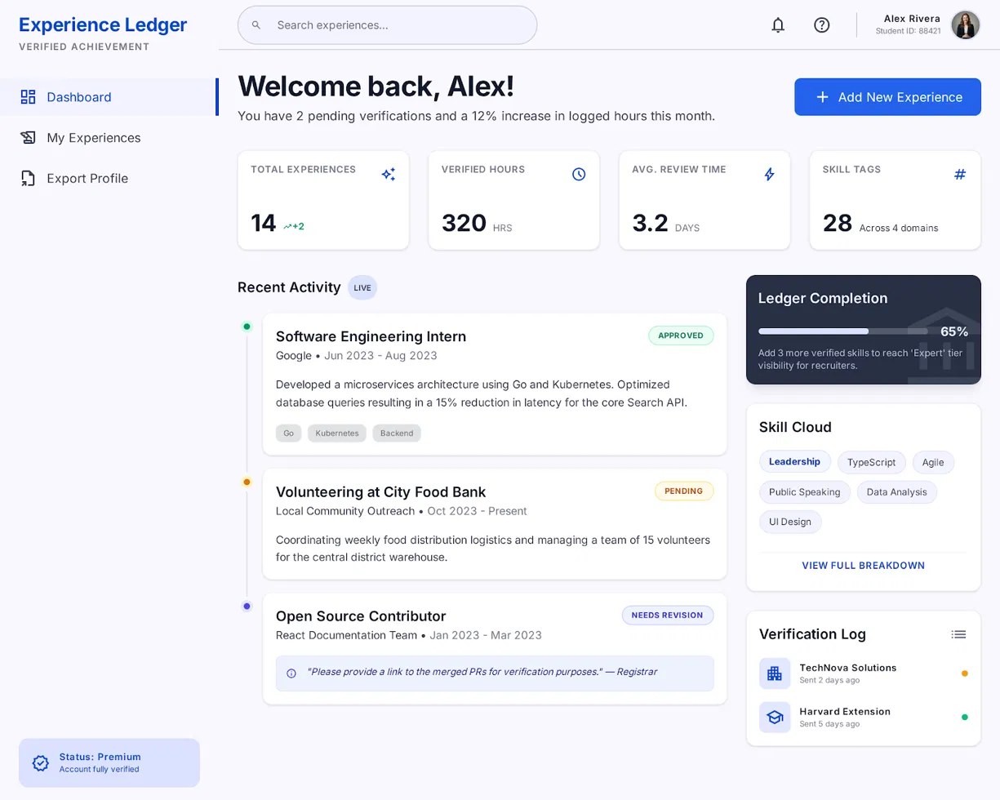
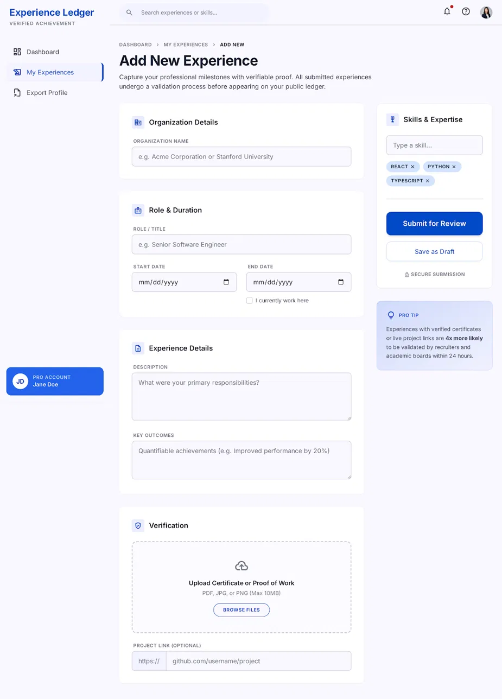
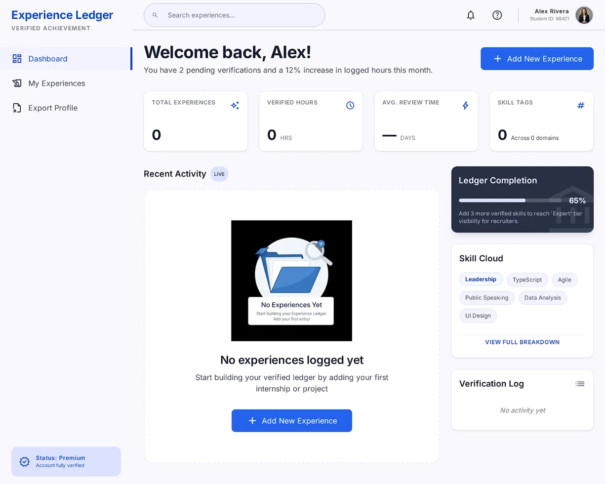
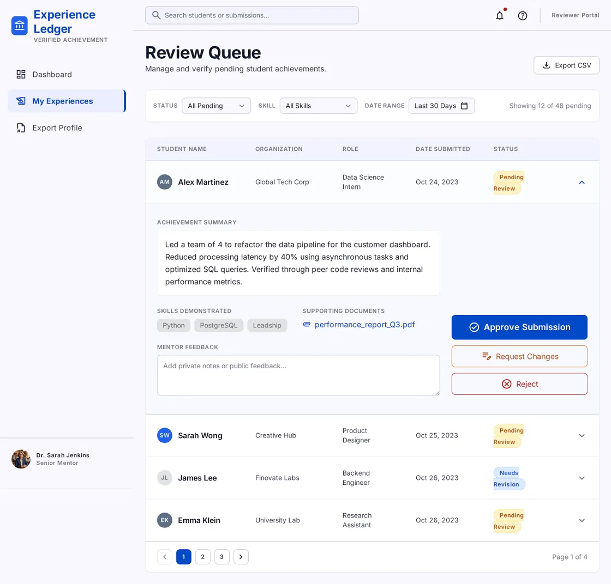
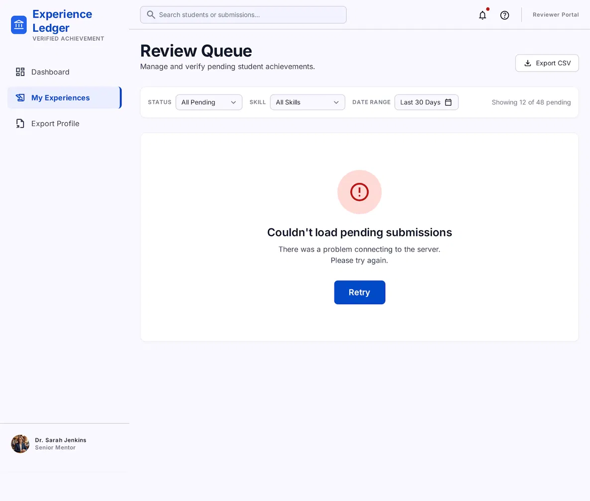
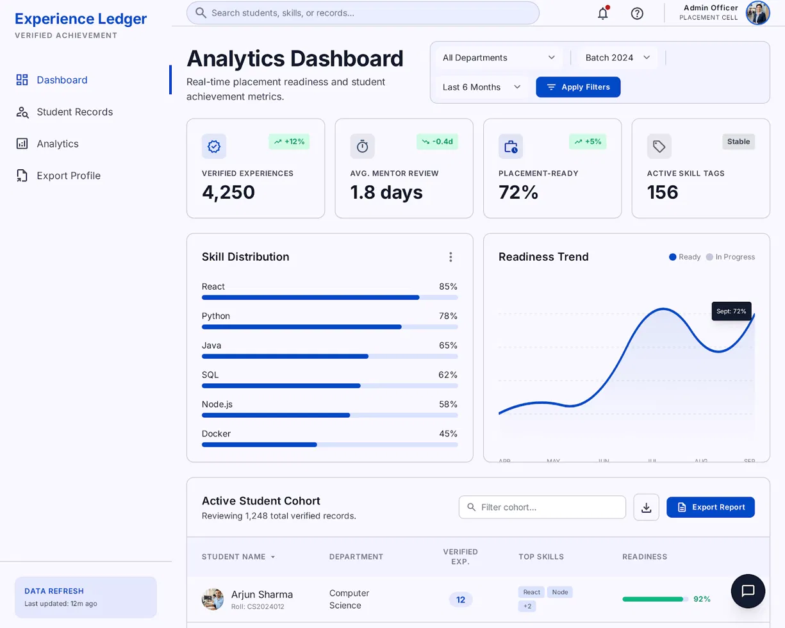

# Experience Ledger

A centralized platform for students to log internships and projects in a structured, mentor-verified format — giving institutions analytics-driven visibility into skill development and placement readiness.

## Problem

Internship and project experiences are currently recorded informally — scattered across resumes, personal notes, spreadsheets, and chat groups — making it difficult for institutions to verify claims, track skill development, or measure placement readiness at scale.

## Solution

Experience Ledger gives every student a structured digital ledger of their experiences. Mentors verify entries through an approval workflow, and the platform aggregates verified data into dashboards for placement cells and department administrators.

## Target Users

- **Students** — log and showcase verified internships/projects
- **Faculty Mentors** — review, verify, and give feedback on submissions
- **Placement Cell / TPOs** — view aggregated readiness and skill data
- **Department Administrators** — access cohort-level analytics for accreditation reporting

## Key Features

- Structured experience-logging form with skill tagging
- Mentor review queue with approve/reject/request-changes workflow
- Placement analytics dashboard (skill distribution, readiness trends, exportable reports)
- Role-based dashboards for students, mentors, and admins

## Mock UX Design

Figma/Stitch Link:
https://stitch.withgoogle.com/projects/2606273715636866083

The wireframes below cover the primary screens, user flows, and states for Experience Ledger.

| Screen | Preview |
|---|---|
| Student Dashboard |  |
| Add Experience Form |  |
| Empty State |  |
| Mentor Review Queue |  |
| Review Queue — Error State |  |
| Placement Analytics Dashboard |  |

This mock UX demonstrates the application's primary screens, navigation flow, and major user journeys across the student, mentor, and placement cell/admin roles.

## Project Status

- ✅ Product Requirement Document (PRD) completed
- ✅ GitHub repository set up
- ✅ Mock UX & User Flow Design completed
- 🔜 Video walkthrough